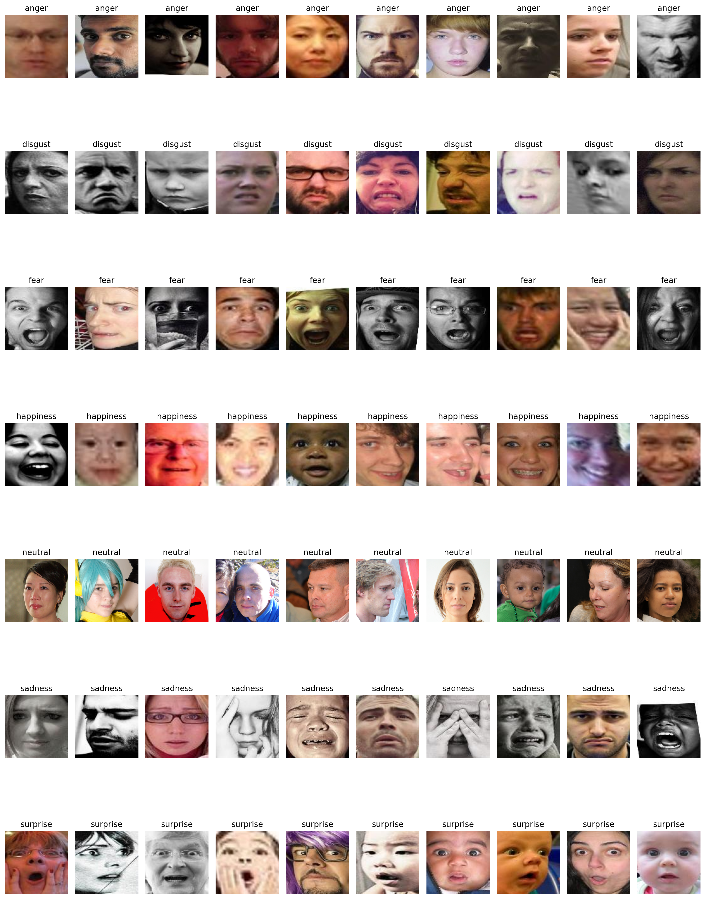

# Facial Expression Recognition with Neural Networks

This project focuses on facial expression recognition using TensorFlow/Keras. The assignment compares multiple neural network architectures to understand how model design affects classification performance on facial expression data.

## Assignment Objective

The goal of this assignment is to build technical proficiency in TensorFlow/Keras by evaluating and comparing different neural network approaches for facial expression recognition.

The work is organized around three main stages:

1. Establish a performance baseline using feed-forward neural networks.
2. Design, train, and optimize custom Convolutional Neural Networks (CNNs) to better capture spatial facial features.
3. Benchmark the custom models against established architectures such as ResNet or VGG, including comparisons between training from scratch and transfer learning.

## What I'm Doing

We are developing and testing neural network models for image-based emotion classification, with a focus on:

- preprocessing facial expression data for model training
- building baseline feed-forward neural networks
- implementing custom CNN architectures in TensorFlow/Keras
- evaluating model accuracy and generalization performance
- comparing simple and advanced approaches for facial expression recognition

## What I Will Do Next

The next steps in the assignment are to:

- improve the baseline results through CNN architecture tuning
- experiment with hyperparameters such as learning rate, batch size, number of layers, and regularization
- test transfer learning with pretrained models such as ResNet or VGG
- compare scratch-trained models against pretrained alternatives
- analyze results to determine which approach delivers the best classification accuracy

## Expected Outcome

By the end of this assignment, the project should provide a clear comparison of:

- feed-forward neural networks vs custom CNNs
- custom CNNs vs pretrained deep learning models
- training from scratch vs transfer learning

This comparison will help identify the most effective architecture for facial expression recognition in this project.

